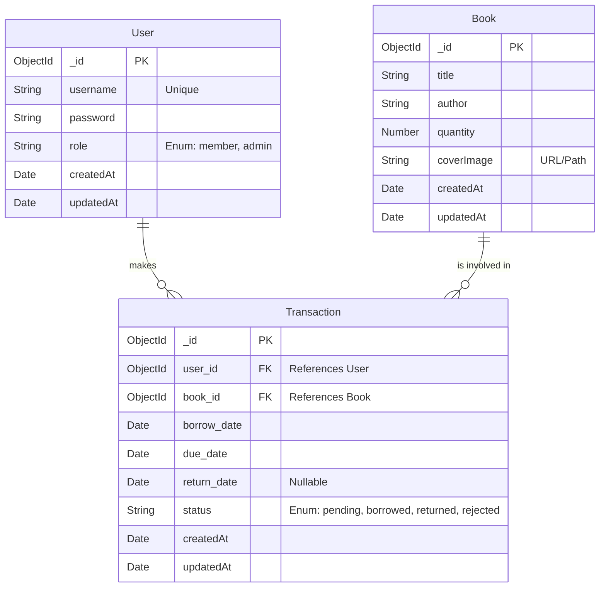

# System Documentation

## Database Schema (ER Diagram)

Although the system uses MongoDB (NoSQL), the following Entity-Relationship (ER) diagram represents the data structure in a relational (SQL) style as requested, including Primary Keys (PK) and Foreign Keys (FK).

## API Documentation

### Authentication (`/`)

| Method | Endpoint | Description | Auth Required | Parameters / Body | Response |
| :--- | :--- | :--- | :--- | :--- | :--- |
| **POST** | `/register` | Register a new user | No | `username`, `password` | 201 Created |
| **POST** | `/login` | Login user | No | `username`, `password` | 200 OK, `token`, `user` |
| **GET** | `/users` | Get all users | Admin | - | 200 OK, `[User]` |
| **GET** | `/admin/users` | Get all users (Alias) | Admin | - | 200 OK, `[User]` |

### Books (`/`)

| Method | Endpoint | Description | Auth Required | Parameters / Body | Response |
| :--- | :--- | :--- | :--- | :--- | :--- |
| **GET** | `/books` | Get all books with pagination | No | `page` (query), `limit` (query), `search` (query) | 200 OK, `data`, `meta` |
| **POST** | `/books` | Create a new book | Admin | `form-data`: `title`, `author`, `quantity`, `coverImage` (file) | 201 Created |

### Transactions (`/`)

| Method | Endpoint | Description | Auth Required | Parameters / Body | Response |
| :--- | :--- | :--- | :--- | :--- | :--- |
| **POST** | `/borrow` | Request to borrow a book | Yes | `book_id`, `due_date` | 201 Created |
| **POST** | `/return` | Return a borrowed book | Yes | `transaction_id` | 200 OK |
| **GET** | `/history/:user_id` | Get borrowing history for a user | Yes | `user_id` (param) | 200 OK, `[Transaction]` |

### Admin Transaction Management (`/admin`)

| Method | Endpoint | Description | Auth Required | Parameters / Body | Response |
| :--- | :--- | :--- | :--- | :--- | :--- |
| **GET** | `/admin/dashboard` | Get dashboard stats (borrowed books) | Admin | - | 200 OK |
| **GET** | `/admin/borrowed-books` | Get list of currently borrowed books | Admin | - | 200 OK |
| **GET** | `/admin/pending-requests` | Get pending borrow requests | Admin | - | 200 OK, `[Transaction]` |
| **PUT** | `/admin/approve/:id` | Approve a borrow request | Admin | `id` (transaction_id in param) | 200 OK |
| **PUT** | `/admin/reject/:id` | Reject a borrow request | Admin | `id` (transaction_id in param) | 200 OK |
